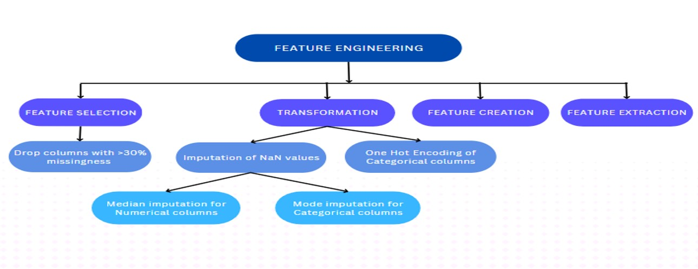
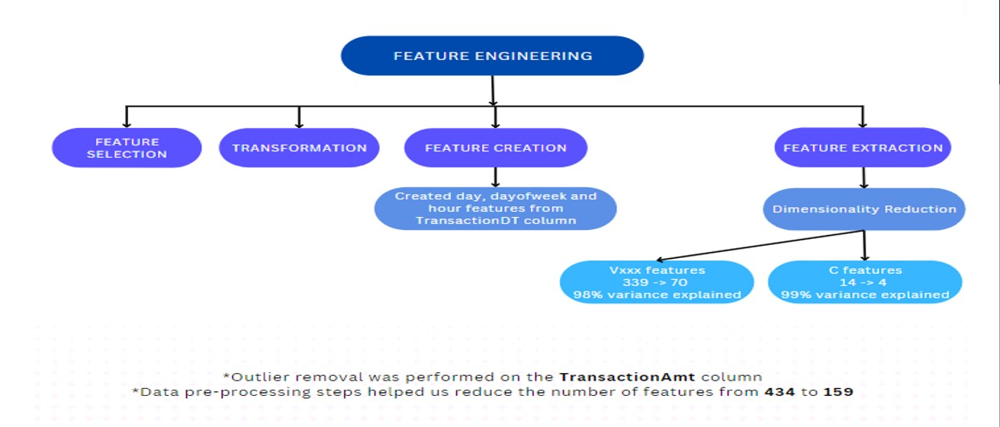
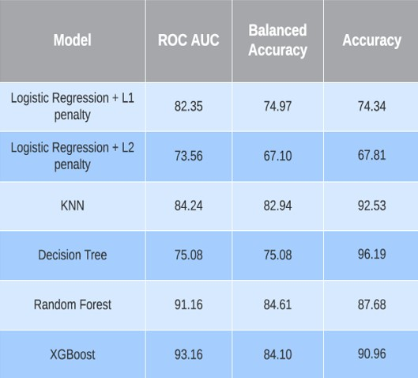

## Machine Learning Pipeline for Fraudulent Credit/Debit Card Transaction Detection

As countries across the world move toward digital currency and cashless societies, it’s important to be aware of the risks that technology can pose for one’s finances. With the prevalence of eCommerce and online payments, anyone can be a target of fraud and identity theft. According to a report from PwC, fraud losses totaled US$42 billion in 2020, affecting 47% of all companies in the past 24 months.

In this project, we have used different machine-learning models on a challenging large-scale dataset. The data comes from Vesta's real-world e-commerce transactions and contains a wide range of features from device type to product features. Founded in 1995, Vesta pioneered the process of fully guaranteed card-not-present (CNP) payment transactions for the telecommunications industry. Since then, Vesta has firmly expanded data science and machine learning capabilities across the globe and solidified its position as the leader in guaranteed eCommerce payments.

On the other end, IEEE-CIS works across a variety of AI and machine learning areas, including deep neural networks, fuzzy systems, evolutionary computation, and swarm intelligence. They’re partnering with the world’s leading payment service company, Vesta Corporation, seeking the best solutions for the fraud prevention industry.

## Goal

In this project, we are predicting if an online transaction is fraudulent or not, as denoted by the binary target isFraud. This will help improve the efficacy of fraudulent transaction alerts for millions of people around the world, thereby helping hundreds of thousands of businesses to reduce their fraud loss and increase their revenue. It will also save people from the hassle of false positives.

## Approach

This work uses the dataset provided by Vesta Corporation through [IEEE-CIS Fraud Detection Prediction Challenge](https://www.kaggle.com/c/ieee-fraud-detection) on Kaggle. The complete dataset was provided in 2 separate tables named Transaction table and Identity table. These tables were joined to create a final training and testing dataset having a total of around 1 million records and 434 input features. Several data pre-processing steps like missing value imputation, dimensionality reduction, categorical variable encodings, additional feature creation, etc. were implemented to create a processed dataset that would help us learn a high-performing unbiased machine learning classifier. Several supervised machine learning models (Logistic Regression, KNN, Decision Tree, Random Forest, XGBoost) were chosen as a candidate to help predict whether transactions will be fraudulent or not.

## Conclusion

Overall, among all the supervised machine learning classifiers XGBoost and Random Forest had the best ROC AUC on the test set. Featuring engineering helped in reducing overfitting and noise, thus improving the prediction and also reducing computation time.

